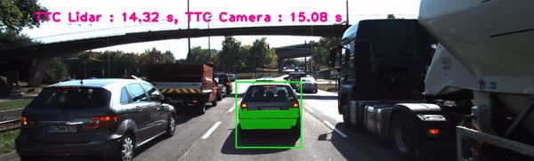
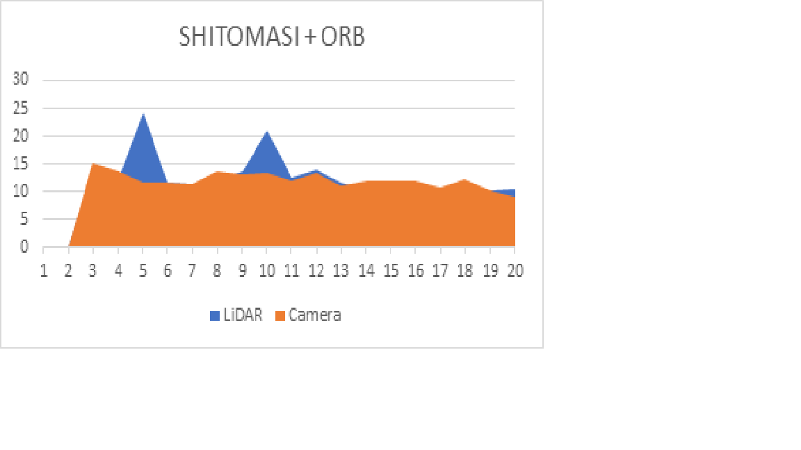
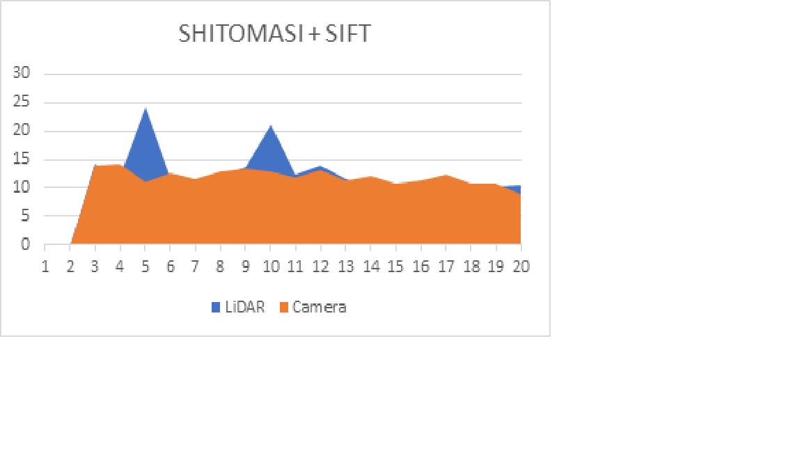

# Time to Collision using 3D Object Tracking

<!-- 
 -->

## Overview
The project uses LiDAR and Camera data captured by an autonomous vehicle in testing in a traffic scenario. Using LiDAR and Camera data, the module calculated Time To Collision (TTC) between the ego and preceding vehicle, as typically done by an Advanced Driver-Assistance System (ADAS) which also uses a RADAR.
The project uses camera-based object classification to cluster LiDAR points and computes TTC estimate by tracking 3D bounding boxes.

## Pipeline
In this final project, you will implement the missing parts in the schematic. To do this, you will complete four major tasks:
1. Detection with Camera :
-  Keypoint detection is perfomed followed by kepypoint matching between consecutive frames. The implementation allows the user to choose a keypoint detection method from classics such as HARRIS, SIFT, SHITOMASI and fast detectors such as FAST. BRIEF, ORB, BRISK, AKAZE and FREAK.
- After keypoints detection, desciptors are extracted for the keypoints. Keypoint extraction can be chosen by the user from the following options : BRISK, BRIEF, ORB, FREAK, AKAZE, SIFT.
The implementation of keypoints detection and descriptor extraction is done as a sub-project and can be reviewed [here](https://github.com/Ytodi31/2D_Feature_Mapping).
2. Detection with LiDAR :
- LiDAR point cloud data was loaded and region of interest was extracted with a focus on the preceding vehicle.
- The LiDAR data points in the region of interest were clustered by enclosing it in bounding boxes with a shrink factor to deal with edge cases.
3. Tracking 3D Objects :
- Bounding boxes are matched between current frame and previous frame for 3D tracking of camera points and Time to Collision is calculated based on relative distance ratios for the camera estimate and the closes point in the x-direction for LiDAR estimate.

## Dependencies
* cmake >= 2.8
  * All OSes: [click here for installation instructions](https://cmake.org/install/)
* make >= 4.1 (Linux, Mac), 3.81 (Windows)
  * Linux: make is installed by default on most Linux distros
  * Mac: [install Xcode command line tools to get make](https://developer.apple.com/xcode/features/)
  * Windows: [Click here for installation instructions](http://gnuwin32.sourceforge.net/packages/make.htm)
* OpenCV >= 4.1
  * This must be compiled from source using the `-D OPENCV_ENABLE_NONFREE=ON` cmake flag for testing the SIFT and SURF detectors.
  * The OpenCV 4.1.0 source code can be found [here](https://github.com/opencv/opencv/tree/4.1.0)
* gcc/g++ >= 5.4
  * Linux: gcc / g++ is installed by default on most Linux distros
  * Mac: same deal as make - [install Xcode command line tools](https://developer.apple.com/xcode/features/)
  * Windows: recommend using [MinGW](http://www.mingw.org/)

## Build and Run

`git clone https://github.com/Ytodi31/3D_Object_Tracking` \
` cd 3D_Object_Tracking` \
` mkdir build ` \
`cmake` \
`make` \
`./3D_object_tracking.`

## Results
The result of the implementation can be seen in the image above for a series of frames captured in city traffic.

From the results, it can be observed that LiDAR estimation is off in certain scenarios. This happens as a result of keypoints being too close to each other in consecutive frames.

The resukts from Camera detection vary alot on the selection of keypoint detector and descriptor extractor. After an analysis, its found that SHITOMASI detector with ORB descriptor performs the best followed by SHITOMASI coupled with SIFT descriptor.

A comparison of the results from LiDAR with Camera for the above two detector - descriptor pair is shown below :

The y-axis depeicts the time to collision and x axis depicts the frame number.
1. SHITOMASI + ORB

2. SHITOMASI + SIFT

A detailed report can be found [here](https://drive.google.com/file/d/1M3NOZ1Tf5sOIc7oROxquHQiv1mDBUFqN/view?usp=sharing).
